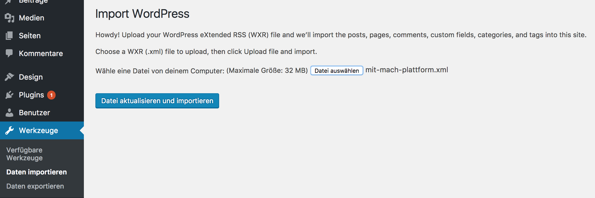
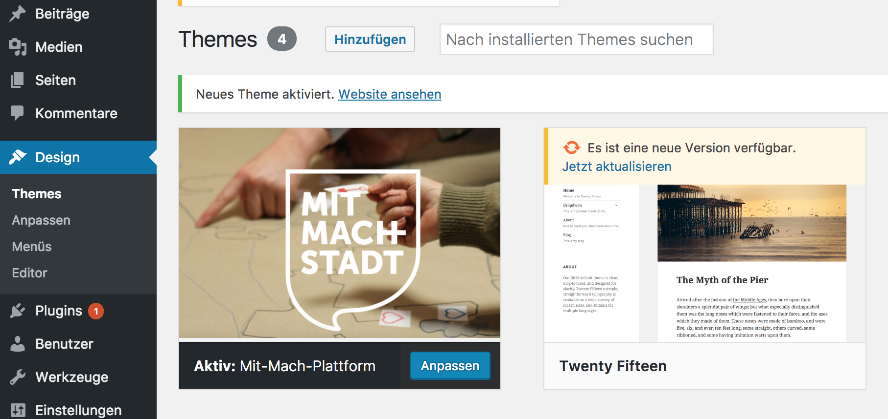

# MitMachPlattform
Auf dieser digitalen Plattform können sich einzelne Bürgerinnen und Bürger austauschen. Will man sich spontan zu Aktivitäten verabreden – ob im Bereich Freizeit, Stadtraumgestaltung, Willkommenskultur oder zur allgemeinen Verbesserung der Lebensqualität in der eigenen Nachbarschaft – die Planung gemeinsamer Aktionen, die Diskussion über bestimmte Themen, das Finden von Mitstreiter/innen für die eigene Idee oder die Terminierung des nächsten Treffens können über die Plattform abgewickelt werden. Die digitale Plattform ist im Projekt „Mit-Mach-Stadt Brandis: Bürgerbeteiligung von Übermorgen“ entstanden, dem gemeinsamen Projekt der Universität der Künste Berlin und der Stadt Brandis, gefördert vom Sächsischen Staatsministerium des Innern (SMI) im Rahmen der Initiative Innovationskommune Sachsen 2016/2017.

## Applikation
Lightweight Community-App ohne Nutzer-Registrierung und -Login.
Bedarf also redaktioneller Beobachtung eines Wordpress-Redakteurs.

Die Mit-Mach-Plattform intendiert schnelle Vernetzung von Interessensgemeinschaften.
Man kann sich austauschen, spontan zu Aktivitäten verabreden oder auch nur Mitteilungen machen.
Autoren eines Beitrags werden über Teilnehmer und Kommentare informiert. (per mail)

## Voraussetzungen
Wordpress installieren - getestete Version ist 4.6.1 !
   - Download der [Wordpress Version 4.6.1](https://wordpress.org/download/release-archive/)
   - Installation nach folgender Anleitung:
      [Wordpress in 5 Minuten istallieren](https://www.blogaufbau.de/wordpress-installieren-in-5-minuten/)

## Installation

1. "mit-mach-plattform"-Ordner und Plugins-Ordner aus diesem Git-Hub Verzeichnis downloaden.

2. "mit-mach-plattform"-Ordner, der das "mit-mach-plattform"-Theme beinhaltet, über ein FTP-Programm in das entsprechende Wordpress-Verzeichnis (/wp-content/themes) laden.

3. Inhalte des Plugins-Ordners, in dem sich alle benötigten Plugins befinden, über FTP in das entsprechende Wordpress-Verzeichnis (/wp-content/plugins) laden

4. Advanced Custom Fields Pro Plugin lizensieren und aktivieren

5. Wordpress Importer ausführen (Menü->Werkzeuge->Daten importieren -> letzter Punkt Wordpress Importer -> hier mit-mach-plattform.xml uploaden)

6. Nun Theme aktivieren -> Mit-Mach-Plattform

Das wars!

## Beispiel

http://www.mitmachen.mit-mach-stadt.de/

## Lizenz

GNU GENERAL PUBLIC LICENSE

